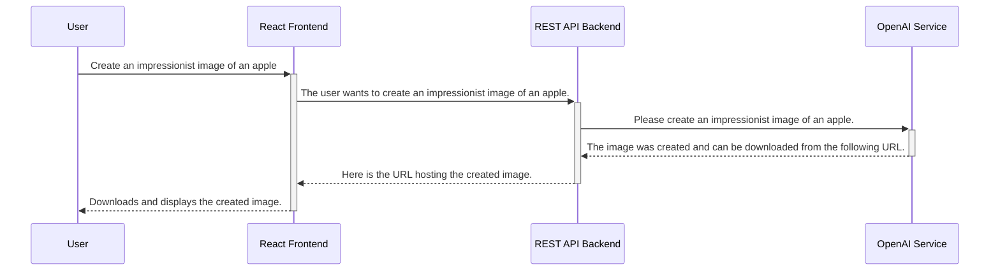

# DALL-E In Class Demonstration

- [DALL-E In Class Demonstration](#dall-e-in-class-demonstration)
  - [Overview](#overview)
  - [Architecture](#architecture)

## Overview

The original intent of this repository was to demonstrate integrating with
OpenAI using Python. This is meant as a practical and modern example for
students taking an
[AP Introduction to Computer Science Principles](https://apcentral.collegeboard.org/courses/ap-computer-science-principles/course)
course. In the interest of time, some functionality may have been omitted, and
others may have been simplified. The code in this repository is for development
purposes only and has not been tested in a production environment. 

## Architecture

The application in this repository consists of two primary implementations
1. Backend: A RESTful API built using Python (3.10) and Flask.
2. Frontend: A React Single Page Application using Typescript.

An example successful flow for the user might look as follows:

